# Project_template

Это шаблон для решения проектной работы. Структура этого файла повторяет структуру заданий. Заполняйте его по мере работы над решением.

# Задание 1. Анализ и планирование

<aside>

Чтобы составить документ с описанием текущей архитектуры приложения, можно часть информации взять из описания компании и условия задания. Это нормально.

</aside

### 1. Описание функциональности монолитного приложения

**Управление отоплением:**

1. Пользователи могут:
	1. Получать информацию о всех устройствах управления отоплением, включая статус включения и температуру отопления.
	2. Получать информацию о конкретном устройстве отопления, включая статус включения и температуру отопления.
	3. Отключать / выключать и выставлять температуру отопления.
2. Система поддерживает:
	1. Получение информации о всех устройствах для управления отоплением, и для одного конкретного устройста по его ID.
	2. Создание, удаление, изменение устройств для управления отоплением в системе.
	3. Изменение статуса включения и температуры для устройств управления отоплением.

**Мониторинг температуры:**

1. Пользователи могут
	1. Получать текущую температуру для всех датчиков температура.
	2. Получать текущую температуру с конкретного датчика температуры.
	3. Получать текущую температуру для локации.
2. Система поддерживает:
	1. Получение информации о всех устройствах для всех датчиков температуры, и для одного конкретного датчика по его ID.
	2. Создание, удаление и изменение информации о датчике температуры в системе.
	3. Получение информации о температуе с датчика температуры в определенной локации.


### 2. Анализ архитектуры монолитного приложения

1. Язык программирования: `Go`
2. База данных: PostgreSQL
3. Взаимодействие между компонентами: Синхронное, запросы выполняются последовательно.
4. Технологии авторизации и аутентефикации: Отсутствуют
5. Архитектура: Монолит, вся компоненты системы реализованы в рамках одного приложения.
6. Масштабирование: Ограниченное. Нельзя масштабировать отдельный компонент.
7. Развертывание: Развертывание требует остановки всего приложения


### 3. Определение доменов и границы контекстов

#### Домен: Управление устройствами умного дома

**Контекст 1.** Управление датчиками
- сущности: Датчик
- объекты-значения:
- агрегаты:
- репозитории: репозиторий умного дома
- сервисы: сервис управления умным домом

**Контекст 2.** Получение информации о температуре
- сущности: Датчик температуры
- объекты-значения: 
- агрегаты: 
- репозитории: репозиторий умного дома
- сервисы: сервис управления умным домом


### **4. Проблемы монолитного решения**

- При раскатке необходимо останваливать работу всего приложения. При падаении одного компонента, останавливается работа всего приложения.
- Нельзя масштабировать отдельный компонент приложения (прим. нельзя отдельно масштабировать temprature_service)

### 5. Визуализация контекста системы — диаграмма С4


PUML - [Диаграмма контекста](diagrams/puml/context%20-%20task1.puml)

Like C4 - "Диаграмма контекста - Задание 1" - `id : context`

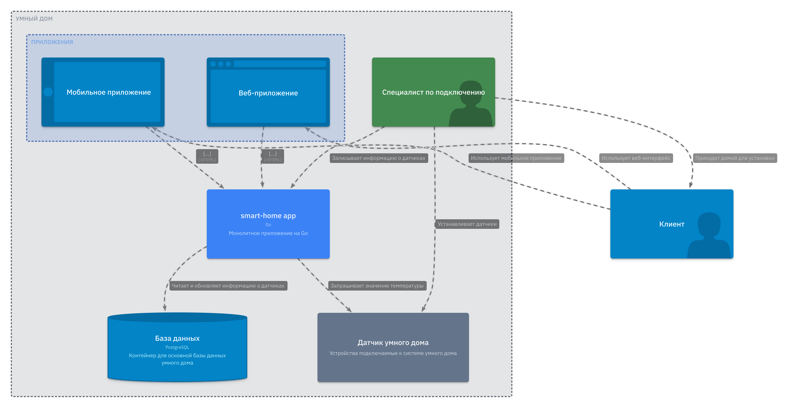


# Задание 2. Проектирование микросервисной архитектуры


**Диаграмма контейнеров (Containers)**

PUML - [Диаграмма контейнеров](diagrams/puml/container%20-%20task2.puml)

Like C4 - "Диаграмма контейнеров - Задание 2" - `id : view_p09hzd`

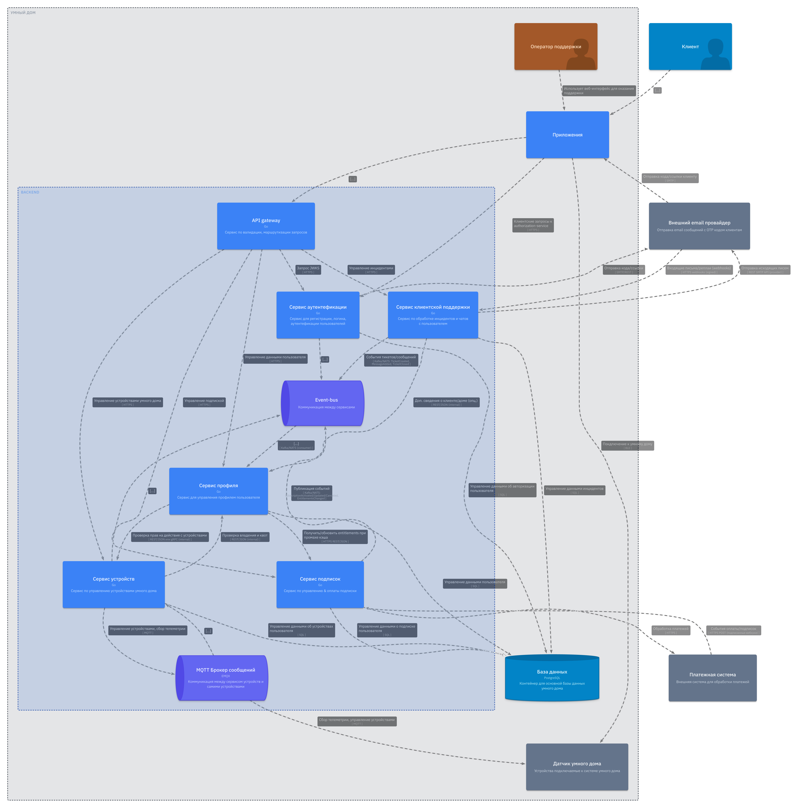


**Диаграмма компонентов (Components)**

1. Сервис API Gateway
	1. PUML - [Диаграмма компонентов](diagrams/puml/component%20-%20api-gateway%20-%20task2.puml)
	2. Like C4 - "Диаграмма компонентов - сервис API gateway - Задание 3" - `id : gateway`
	3. 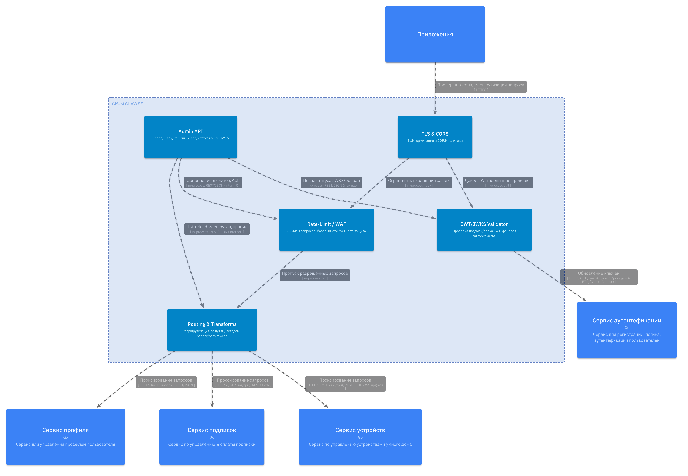
2. Сервис авторизации - authorization-service
	1. PUML - [Диаграмма компонентов](diagrams/puml/component%20-%20auth-service%20-%20task2.puml)
	2. Like C4 - "Диаграмма компонентов - сервис авторизации - Задание 3" - `id : auth-service`
	3. 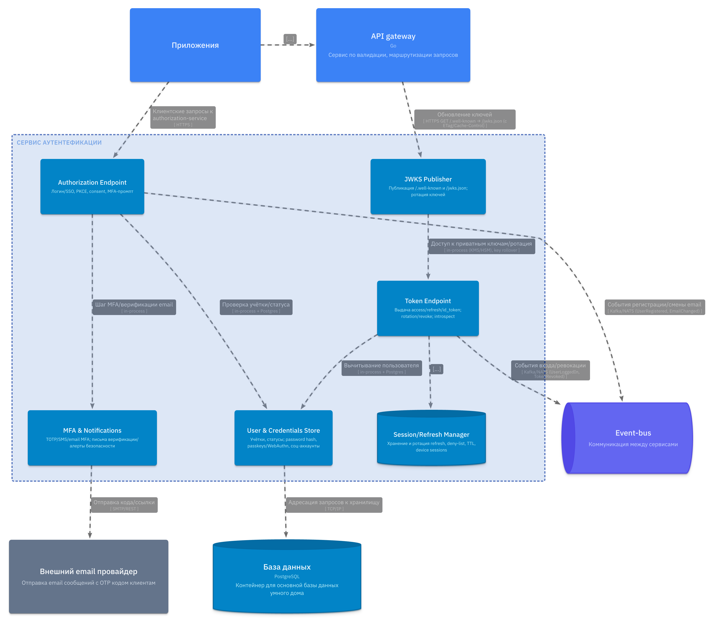
3. Сервис профиля пользователя - user-profile service
	1. PUML - [Диаграмма компонентов](diagrams/puml/component%20-%20user-service%20-%20task2.puml)
	2. Like C4 - "Диаграмма компонентов - сервис профиля - Задание 3" - `id : user-service`
	3. 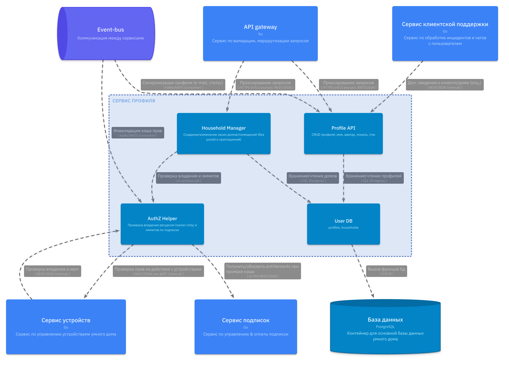
4. Сервис устройств - device-service
	1. PUML - [Диаграмма компонентов](diagrams/puml/component%20-%20device-service%20-%20task2.puml
	2. Like C4 - "Диагармма компонентов - сервис устройств - Задание 3" - `id : device-service`
	3. 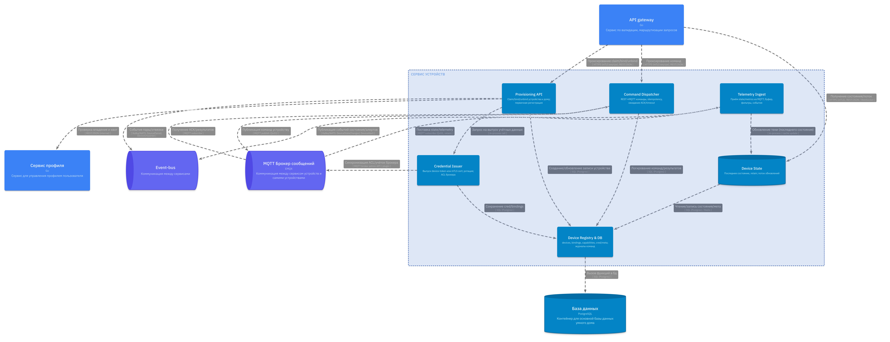
5. Сервис подписок - billing-service
	1. PUML - [Диаграмма компонентов](diagrams/puml/component%20-%20billing-service%20-%20task2.puml)
	2. Like C4 - "Диаграмма компонентов - сервис подписок - Задание 3" - `id : billing-service`
	3. 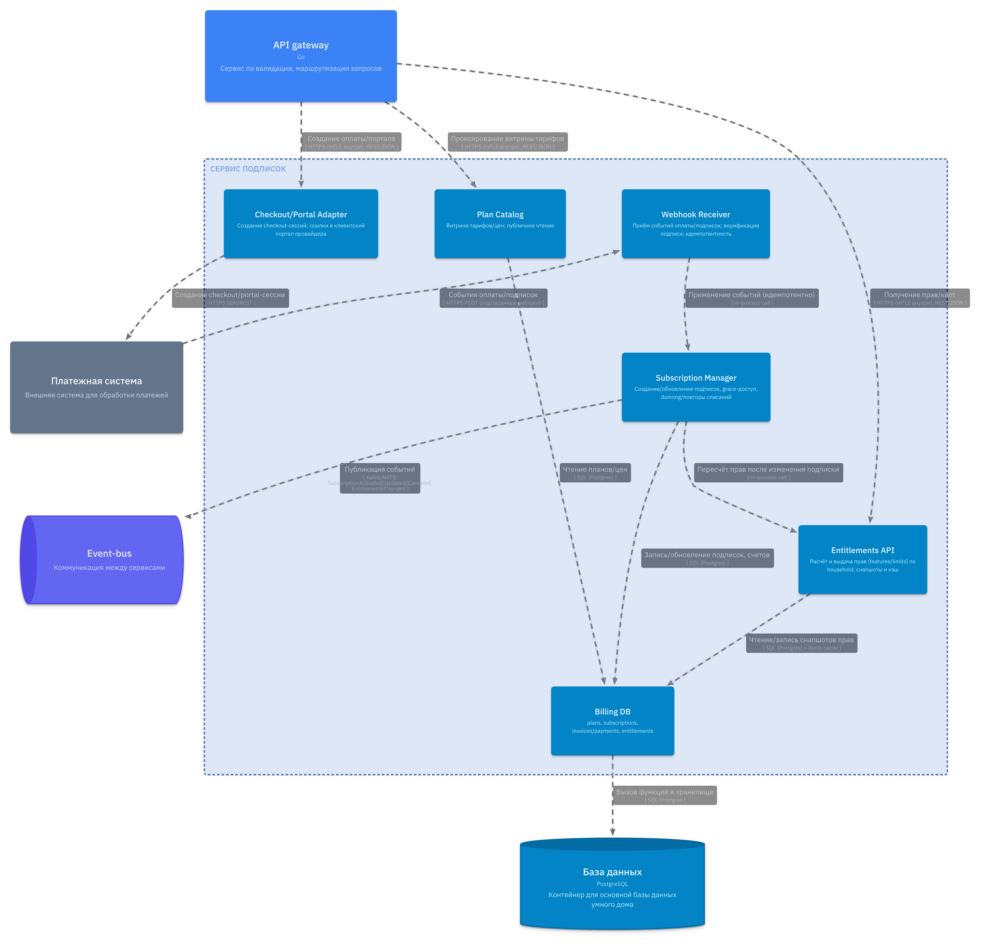
6. Сервис поддержки - callcenter-service
	1. PUML - [Диаграмма компонентов](diagrams/puml/component%20-%20callcenter-service%20-%20task2.puml)
	2. Like C4 - "Диаграмма компонентов - сервис поддержки - задание 3" - `id : callcenter-service`
	3. 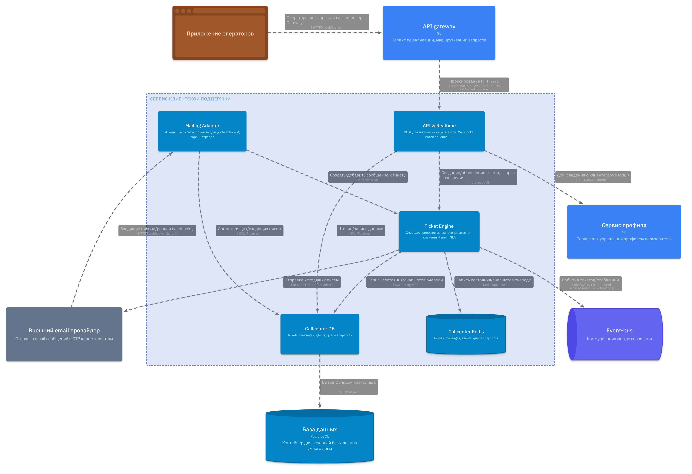

**Диаграмма кода (Code)**

1. Компонент - Token Endpoint - [Диаграмма классов](diagrams/puml/code/authz-token.puml)
	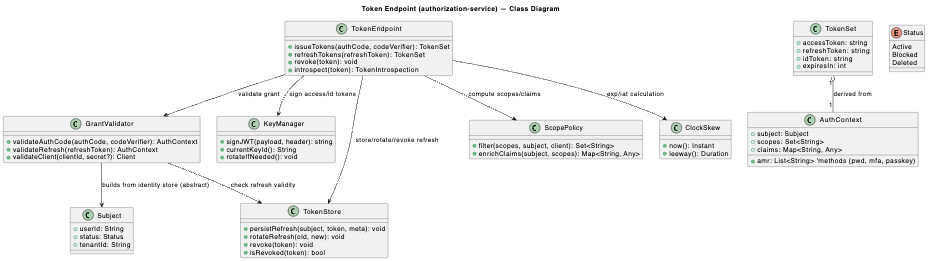
2. Компонент - Device Credential Issuer - [Диаграмма последовательности](diagrams/puml/code/dev-cred-issuer.puml)
	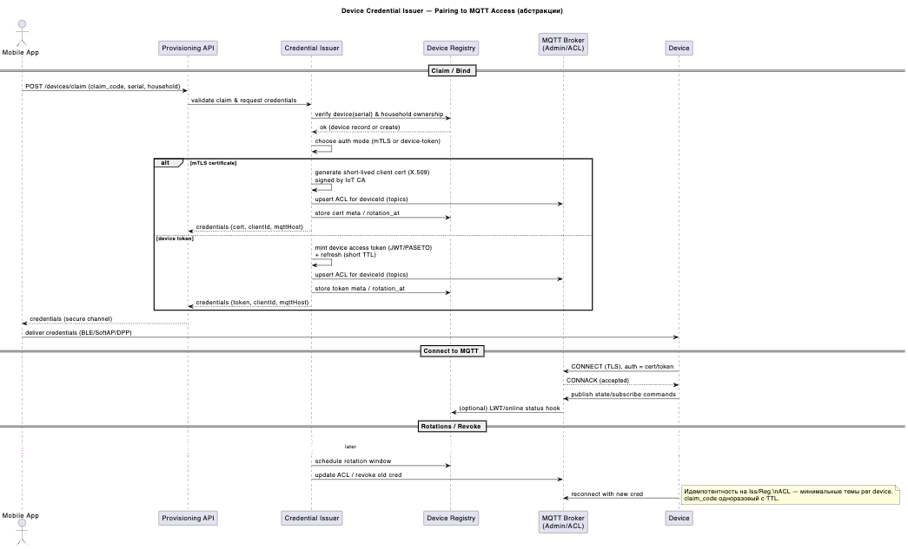
3. Компонент - JWT Validation via JWKS - [Диаграмма последовательности](diagrams/puml/code/gateway-jwt.puml)
	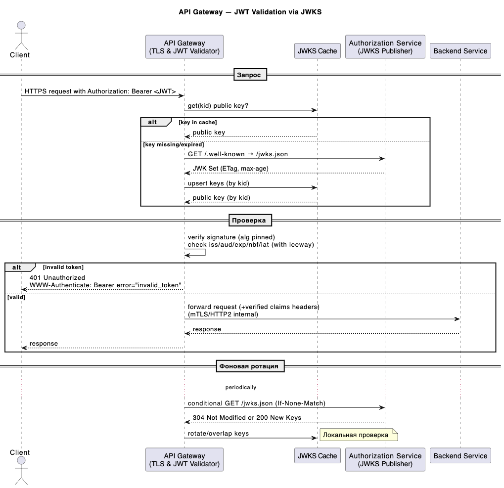

# Задание 3. Разработка ER-диаграммы

[ER Диаграмма](diagrams/puml/er/er.puml)

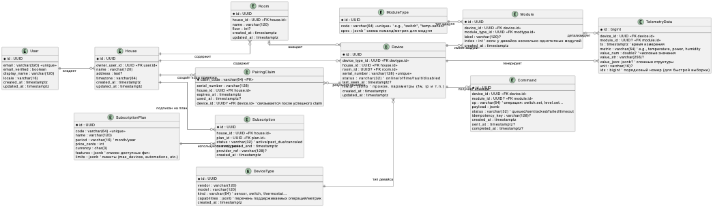

# Задание 4. Создание и документирование API

### 1. Тип API

**Выбранный микросервис:** Сервис устройств (device-service)

**Тип API:** REST API

**Обьяснение:**

Какие сервисы взаимодействуют:
1. API-Gateway (маршрутизирует запросы клиентского приложения)
2. Device service - принимает запросы API-Gateway, передает запросы умным устройствам.

В данном API рассматриваются функции:
	1. Получение списка устройств
	2. Получение устройства по id
	3. Получение текущего состояния устройства
	4. Привязка нового устройства
	5. Отправка комманды устройству
 Эти операции синхронные и требуют мгновенного ответа. REST проще внедрить и поддерживать в небольшой команде, интегрируется с нашим API Gateway и хорошо документируется через OpenAPI. AsyncAPI будет более подходящим асинхронных потоков через MQTT брокер для сбора телеметрии с IOT устройств.


### 2. Документация API

Документация API - [REST API](open-api/open-api-devices.yaml)

# Задание 5. Работа с docker и docker-compose

Перейдите в apps.

Там находится приложение-монолит для работы с датчиками температуры. В README.md описано как запустить решение.

Вам нужно:

1) сделать простое приложение temperature-api на любом удобном для вас языке программирования, которое при запросе /temperature?location= будет отдавать рандомное значение температуры.

Locations - название комнаты, sensorId - идентификатор названия комнаты

```
	// If no location is provided, use a default based on sensor ID
	if location == "" {
		switch sensorID {
		case "1":
			location = "Living Room"
		case "2":
			location = "Bedroom"
		case "3":
			location = "Kitchen"
		default:
			location = "Unknown"
		}
	}

	// If no sensor ID is provided, generate one based on location
	if sensorID == "" {
		switch location {
		case "Living Room":
			sensorID = "1"
		case "Bedroom":
			sensorID = "2"
		case "Kitchen":
			sensorID = "3"
		default:
			sensorID = "0"
		}
	}
```

2) Приложение следует упаковать в Docker и добавить в docker-compose. Порт по умолчанию должен быть 8081

3) Кроме того для smart_home приложения требуется база данных - добавьте в docker-compose файл настройки для запуска postgres с указанием скрипта инициализации ./smart_home/init.sql

Для проверки можно использовать Postman коллекцию smarthome-api.postman_collection.json и вызвать:

- Create Sensor
- Get All Sensors

Должно при каждом вызове отображаться разное значение температуры

Ревьюер будет проверять точно так же.

**Это задание выполнено**


